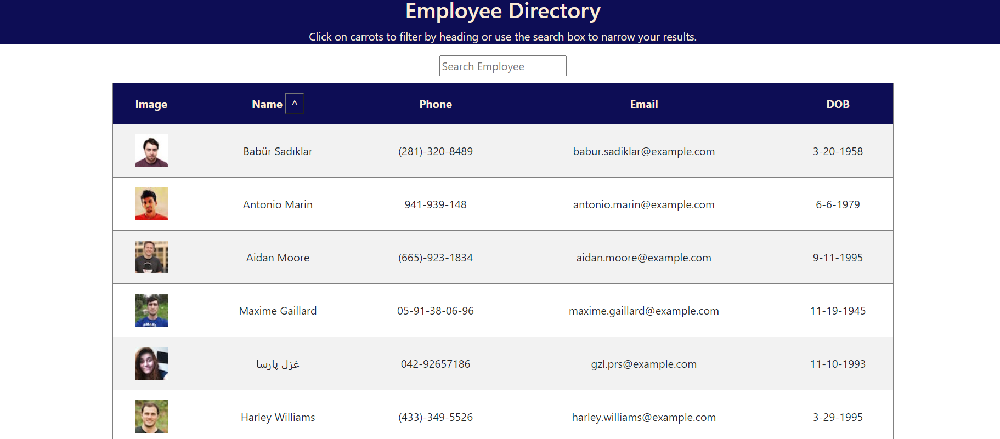

# Employee Directory 

[Deployed Link](https://pensive-snyder-69b1b3.netlify.app)

## Project Description

This is an application that can hold all of your employees. You can search by their name or phone number to sort through the list. You can also order the list in alphabetical order, ascending or descending.

## Table of Contents

- [Installation](#installation)
- [License](#license)
- [Questions](#questions)

## Installation

npm i

## License

This project requires the MIT license.

## Questions?

Contact me by GitHub or Email:

- GitHub username: [scmcphee9](https://github.com/scmcphee9)
- Email Address: scmcphee9@gmail.com
